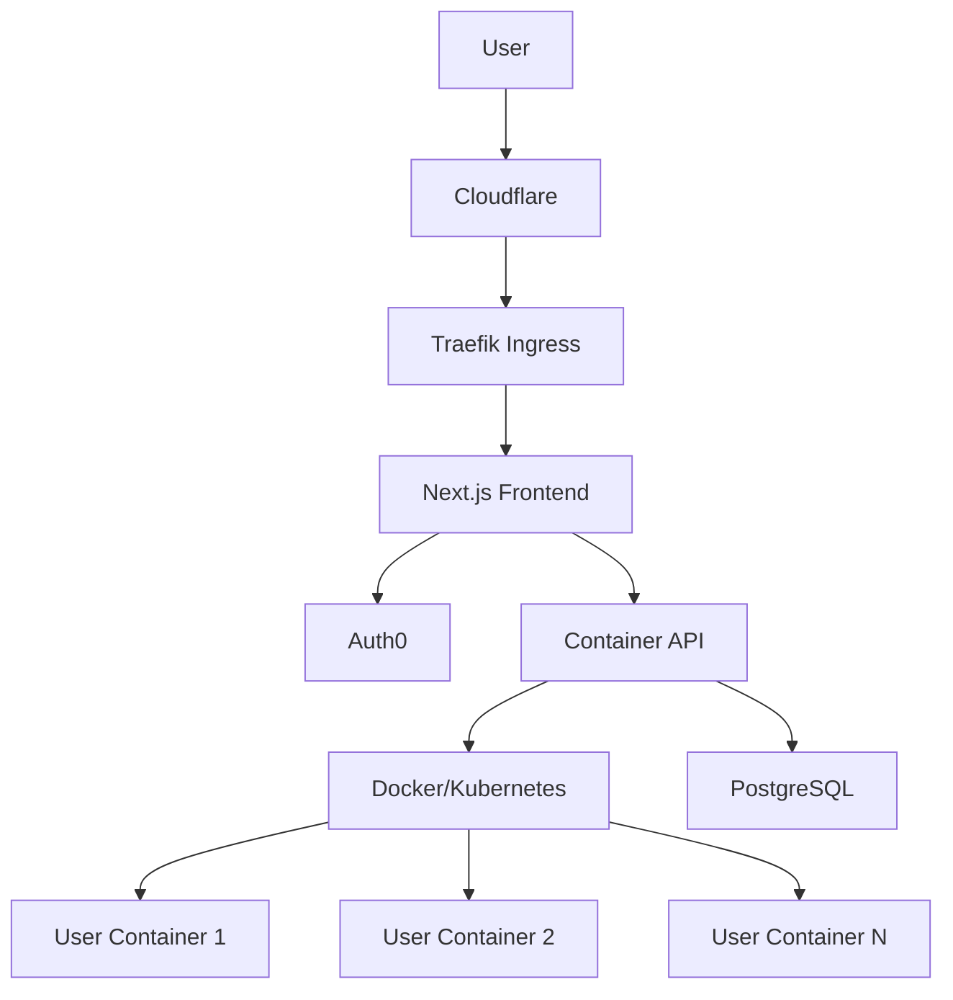

# 🐳 Container App - Per-User Containerized Environments

[](https://github.com/MrRyanAlexander/docker-container-app/actions/workflows/ci-cd.yml)
[](https://github.com/MrRyanAlexander/docker-container-app/actions)
[](https://codecov.io/gh/MrRyanAlexander/docker-container-app)
[](https://github.com/MrRyanAlexander/docker-container-app)
[](https://github.com/MrRyanAlexander/docker-container-app)
[](./LICENSE)

> A modern, secure, and scalable web application where each authenticated user receives their own isolated Docker container environment.

## ✨ Features

- 🔐 **Secure Authentication** - Auth0 integration with JWT validation
- 🐳 **Per-User Containers** - Isolated Docker environments with resource limits
- 🚀 **Modern Stack** - Next.js 15, TypeScript, Tailwind CSS
- ⚡ **Production Ready** - Kubernetes, Traefik, automated CI/CD
- 🛡️ **Enterprise Security** - DDoS protection, network policies, RBAC
- 📊 **Monitoring** - Health checks, metrics, structured logging
- 🧪 **Comprehensive Testing** - 67 tests across unit, integration, and E2E

## 🏗️ Architecture



## 🚀 Quick Start

### Prerequisites
- Node.js 18+ 
- Docker Desktop
- kubectl & Helm (for production)

### 1. Clone & Setup
```bash
git clone https://github.com/MrRyanAlexander/docker-container-app.git
cd docker-container-app
cp env.example .env
```

### 2. Configure Environment
```bash
# Edit .env with your Auth0 credentials
AUTH0_SECRET=your-32-char-secret
AUTH0_ISSUER_BASE_URL=https://your-domain.auth0.com
AUTH0_CLIENT_ID=your-client-id
AUTH0_CLIENT_SECRET=your-client-secret
```

### 3. Start Development
```bash
# Start all services
docker-compose up -d

# Or start database only and run frontend locally
docker-compose up -d db traefik
cd frontend && npm install && npm run dev
```

### 4. Access Application
- **App**: http://localhost:3000
- **Traefik Dashboard**: http://localhost:8080

## 🧪 Testing

Our comprehensive test suite covers all aspects of the application:

### Test Coverage (67 Total Tests)
- **Unit Tests**: 29 tests - Core business logic
- **Integration Tests**: 13 tests - API endpoints & health checks  
- **Simulation Tests**: 8 tests - Container lifecycle
- **E2E Tests**: 17 tests - User flows & responsive design

### Run Tests
```bash
cd frontend

# Run all tests
npm run test:all

# Run specific test suites
npm run test:unit        # Unit tests
npm run test:integration # Integration tests  
npm run test:e2e         # End-to-end tests

# Coverage report
npm run test:coverage
```

### CI/CD Pipeline
Every commit triggers automated:
- ✅ Code quality checks (ESLint, Prettier, TypeScript)
- ✅ All 67 tests across Node.js 18 & 20
- ✅ Security scanning (Trivy, CodeQL, Snyk)
- ✅ Docker build & container testing
- ✅ Kubernetes manifest validation

## 📦 Tech Stack

| Layer | Technology | Purpose |
|-------|------------|---------|
| **Frontend** | Next.js 15, TypeScript, Tailwind | Modern React framework with SSR |
| **Auth** | Auth0, NextAuth.js | Secure authentication & session management |
| **Backend** | Next.js API Routes, Prisma | RESTful API with type-safe database access |
| **Database** | PostgreSQL | Persistent storage for users & containers |
| **Containers** | Docker, Dockerode | Per-user isolated environments |
| **Orchestration** | Kubernetes, Helm | Production container orchestration |
| **Ingress** | Traefik | Routing, SSL termination, rate limiting |
| **Security** | Cloudflare, Network Policies | DDoS protection & network isolation |
| **Monitoring** | Winston, Prometheus | Structured logging & metrics |

## 🏗️ Project Structure

```
docker-container-app/
├── 📁 frontend/              # Next.js application
│   ├── 📁 src/
│   │   ├── 📁 app/           # App Router pages & layouts
│   │   ├── 📁 components/    # Reusable React components
│   │   ├── 📁 lib/           # Utilities & business logic
│   │   └── 📁 __tests__/     # Test suites
│   ├── 📁 e2e/              # Playwright E2E tests
│   └── 📄 Dockerfile        # Frontend container image
├── 📁 kubernetes/           # K8s deployment manifests
├── 📁 helm/                 # Helm charts for production
├── 📁 scripts/              # Deployment & utility scripts
├── 📁 docs/                 # Project documentation
├── 📁 .github/workflows/    # CI/CD pipeline
└── 📄 docker-compose.yml    # Local development environment
```

## 🔒 Security Features

- **Authentication**: Auth0 with MFA support
- **Authorization**: User-scoped container access
- **Network Isolation**: Kubernetes network policies
- **Resource Limits**: CPU/memory constraints per container
- **DDoS Protection**: Cloudflare + Traefik rate limiting
- **Container Security**: Non-root users, read-only filesystems
- **Secrets Management**: Kubernetes secrets, never in environment variables

## 🚀 Production Deployment

### Kubernetes (Recommended)
```bash
# Using Helm
helm install container-app ./helm/container-app

# Or kubectl
kubectl apply -f kubernetes/

# Or deployment script
./scripts/deploy.sh production
```

### Environment Setup
See [`docs/DEPLOYMENT.md`](./docs/DEPLOYMENT.md) for comprehensive deployment guide including:
- Multi-environment setup (dev/staging/prod)
- Database configuration
- Monitoring setup
- Troubleshooting

## 📊 Resource Management

Each user container includes:
- **CPU Limit**: 0.5-2.0 cores (environment dependent)
- **Memory Limit**: 512Mi-2Gi (environment dependent)  
- **Storage**: Persistent volumes for user data
- **Lifetime**: Auto-cleanup after inactivity
- **Networking**: Isolated with ingress-only access

## 🤝 Contributing

1. Fork the repository
2. Create a feature branch: `git checkout -b feature/amazing-feature`
3. Run tests: `npm run test:all`
4. Commit changes: `git commit -m 'Add amazing feature'`
5. Push to branch: `git push origin feature/amazing-feature`
6. Open a Pull Request

### Development Guidelines
- Write tests for new features
- Follow TypeScript best practices
- Update documentation as needed
- Ensure CI pipeline passes

## 📚 Documentation

- 📖 [Deployment Guide](./docs/DEPLOYMENT.md) - Complete deployment instructions
- 📋 [Implementation Plan](./plan.md) - Detailed development roadmap
- 🏗️ [Architecture Overview](./docs/DEPLOYMENT.md#architecture) - System design details

## 🆘 Support & FAQ

**Q: How do I add a new container type?**  
A: See the container manager in `frontend/src/lib/container-manager.ts`

**Q: How do I customize resource limits?**  
A: Update the deployment configurations in `kubernetes/` or `helm/`

**Q: How do I add monitoring?**  
A: Follow the monitoring setup in [`docs/DEPLOYMENT.md`](./docs/DEPLOYMENT.md)

For more questions, [open an issue](https://github.com/MrRyanAlexander/docker-container-app/issues).

## 📄 License

This project is licensed under the BSD-3-Clause License - see the [LICENSE](LICENSE) file for details.

---

<div align="center">
  <strong>Built with ❤️ for developers who need isolated, secure container environments</strong>
</div> 